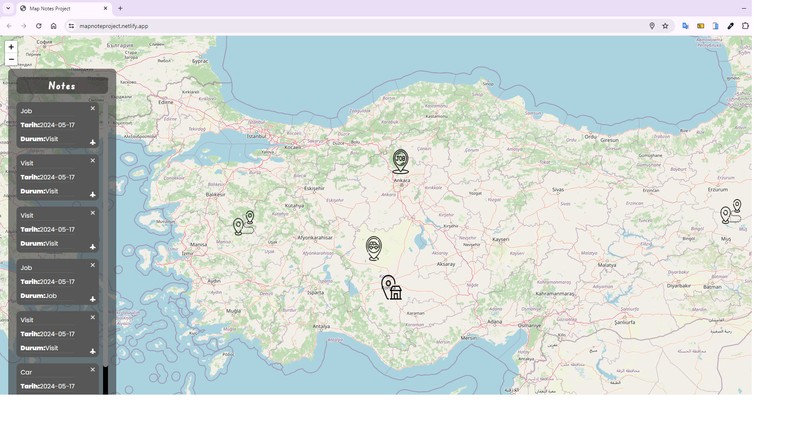

📍 Proje Özeti:
"Harita ve Notlar" adlı web uygulaması, kullanıcıların harita üzerinde belirli noktalara notlar eklemesine imkan tanır. Leaflet kütüphanesi kullanılarak geliştirilen bu uygulama, harita üzerinde hareket etmeyi, yakınlaştırmayı ve yerleri işaretlemeyi kolaylaştırır.

🔍 Özellikler:

Harita üzerinde gezinme ve yakınlaştırma yeteneği
Özel notlar ekleyebilme imkanı sunan işaretleme özellikleri
Kullanıcıların kolayca etkileşimde bulunabileceği bir tasarım

💻 Kullanılan Teknolojiler:

HTML5
CSS3
JavaScript
Leaflet kütüphanesi

<h4>IMAGE</h4>

